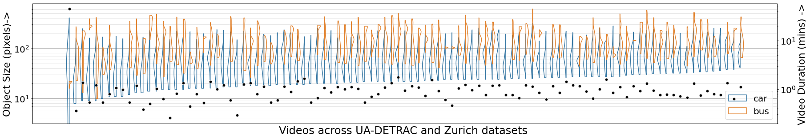

# DDownscale

This repository contains the code and data used in the paper titled 
"DDownscale: Object Size Aware Downscaling for Drone Video Query Systems"

## Code and Datasets
Coming Soon
1) Steps to Download datasets
2) Steps to get meta data about datasets
3) List of analysis done

### Dataset Characteristics
Different videos have different levels of detail of information available (due to differences in camera resolution, camera altitude and orientation). Also different videos may be queried for objects of different sizes,  enabling different scope of downscaling per query.
The below figure shows the high variation of object sizes across different videos and semantic clases.
The distribution car sizes in blue and that of bus in orange.

Additionally note the short durations of videos that we are dealing with, denoted by black marker.

